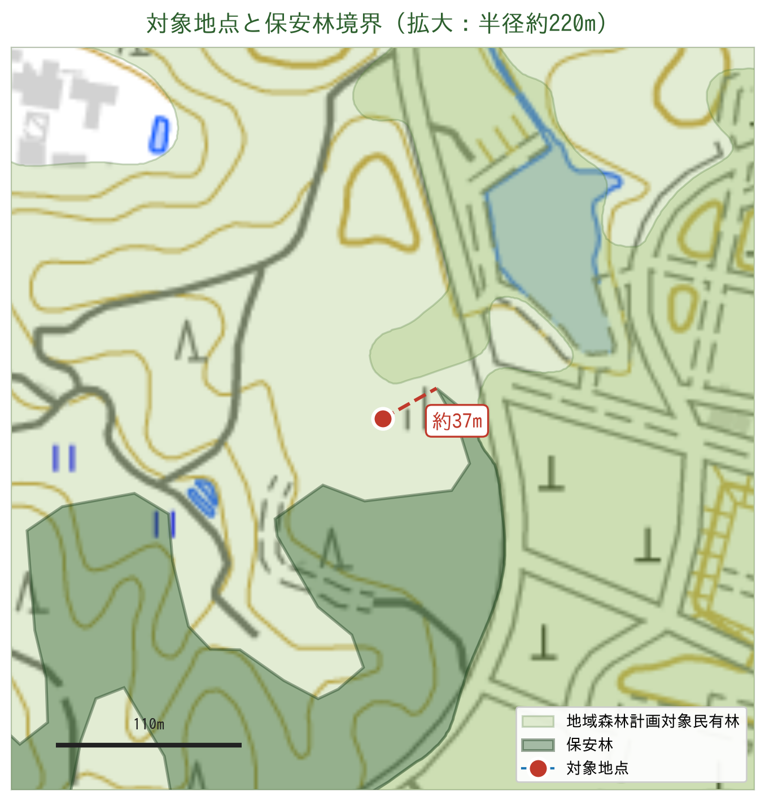
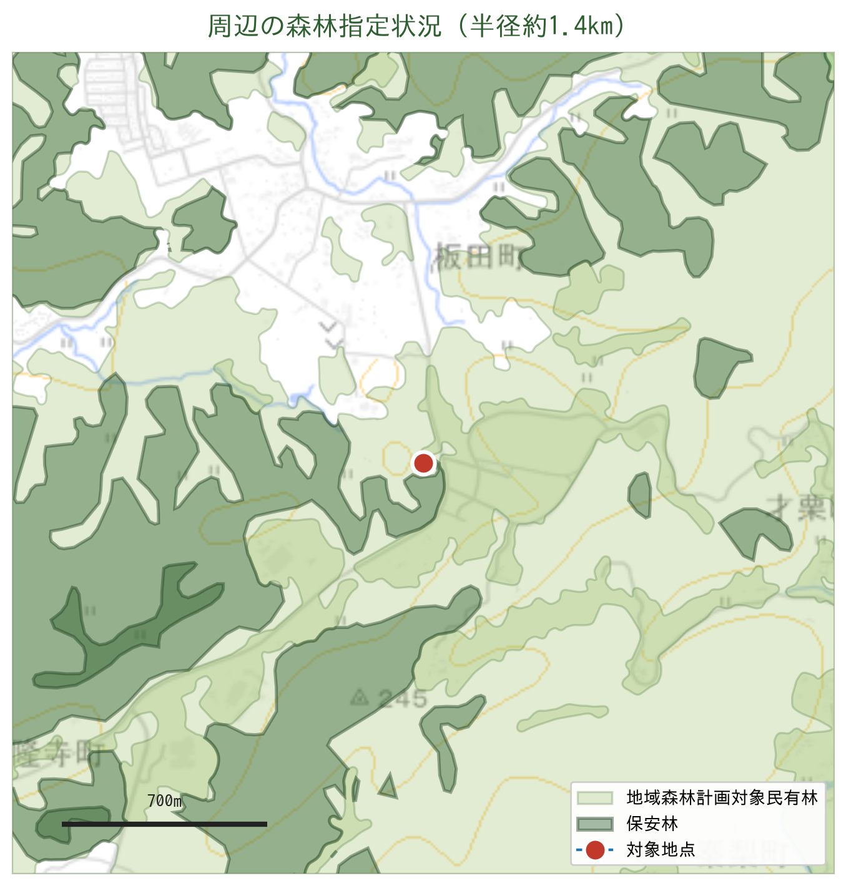

# 保安林 該当確認レポート

| 項目 | 内容 |
| --- | --- |
| 対象座標 | 34.962114039819326, 137.23105862800367 |
| 所在 | 愛知県岡崎市板田町 字東流石（市区町村コード 23202） |
| 判定日 | 2026-09-08 |
| 使用資料 | 全部事項証明書 27筆（名古屋法務局豊田支局 令和7年10月2日発行）／求積図 S=1:2000／国土数値情報「森林地域(A13-15 愛知県)」 |
| 説明資料 | [保安林確認_岡崎市板田町.pptx](./保安林確認_岡崎市板田町.pptx) |

## 結論

**案件地には保安林が含まれる。** 提供された27筆のうち **15筆が登記地目「保安林」**（登記地積の合計 18,203.43㎡＝約1.82ha）。

座標1点に対する公開データ（国土数値情報 A13）だけの判定では「保安林 非該当（最寄り境界まで約37m）」だったが、登記簿により実態が判明した。**公開GISによる机上判定は本件では実態を過小評価している。**

## 判定結果

### 登記簿による判定（確度：高）

| 地目 | 筆数 | 登記地積合計 |
| --- | ---: | ---: |
| **保安林** | **15筆** | **18,203.43㎡（約1.82ha）** |
| 田 | 6筆 | 4,262㎡ |
| 山林 | 6筆 | 7,216㎡ |
| 合計 | 27筆 | 29,681.43㎡ |

**地目「保安林」の15筆**

| 地番 | 地積(㎡) | 地番 | 地積(㎡) | 地番 | 地積(㎡) |
| --- | ---: | --- | ---: | --- | ---: |
| 1番8 | 991 | 22番2 | 1,562 | 27番1 | 540 |
| 11番 | 2,264 | 22番3 | 1,368 | 27番2 | 198 |
| 11番1 | 9.91 | 22番4 | 9.91 | 27番3 | 264 |
| 11番2 | 6.61 | 22番8 | 5,146 | 27番4 | 94 |
| 22番1 | 4,958 | 26番2 | 297 | 27番5 | 495 |

※22番8・22番2・27番1・27番4は分筆後の地積。26番1は昭和46年に一部地目変更あり。

**地目「田」「山林」の12筆**

| 地番 | 地目 | 地積(㎡) | 地番 | 地目 | 地積(㎡) |
| --- | --- | ---: | --- | --- | ---: |
| 12番 | 田 | 1,233 | 19番1 | 山林 | 304 |
| 13番 | 田 | 261 | 21番 | 山林 | 26 |
| 18番 | 田 | 730 | 24番 | 山林 | 33 |
| 19番 | 田 | 611 | 25番 | 山林 | 383 |
| 22番5 | 田 | 95 | 26番1 | 山林 | 5,346 |
| 23番 | 田 | 1,332 | 26番4 | 山林 | 1,124 |

### 公開データによる座標判定（参考・確度：低）

| レイヤ | 判定 | 補足 |
| --- | --- | --- |
| 保安林 | 非該当 | 最寄り境界まで約36.6m（東北東）。最寄点 34.962276, 137.231409 |
| 国有林 | 非該当 | 最寄り約15.2km |
| 地域森林計画対象民有林 | **該当** | 内包 |
| 森林地域（土地利用基本計画） | **該当** | 内包 |





## かかる規制と手続

| # | 規制 | 根拠 | 内容 |
| --- | --- | --- | --- |
| 1 | **保安林** | 森林法 25条・34条 | 指定区域内の立木伐採・土地の形質変更は県知事の許可が必要。蓄電所用地としては原則不適。解除は代替施設がない等の要件が必要で実務上きわめて困難。 |
| 2 | **林地開発許可** | 森林法 10条の2 | 地域森林計画対象民有林で1ha超の開発に必要。検討面積 42,992.45㎡＝約4.3ha のため確実に対象。防災・環境の4要件審査。 |
| 3 | **伐採及び伐採後の造林の届出** | 森林法 10条の8 | 1ha以下の伐採でも岡崎市への事前届出が必要（伐採90〜30日前）。 |

※太陽光は0.5ha超で林地開発許可の対象。蓄電所は「その他」区分で1ha超が基準。

## リスクと検討論点

| リスク度 | 論点 | 内容 |
| --- | --- | --- |
| 高 | 保安林区域が造成範囲に入る | 15筆・登記地積で約1.82ha。造成レイアウト次第では案件不成立。 |
| 高 | 未取得登記簿に追加の保安林がある可能性 | 求積図には1番台を中心に**約30筆**が記載されているが今回の登記簿に含まれていない。全筆の地目確認が必須。 |
| 中 | 林地開発許可の取得期間 | 約4.3haで確実に対象。防災調整池・緑地の確保が必要（緑地35%・調整池5%想定）。 |
| 中 | 登記地積と実測面積の乖離 | 27筆の登記地積 29,681㎡ に対し求積図の実測合計は 99,100㎡。用地費・面積前提の再確認が必要。 |
| 低 | 公開GISでの事前確認が効かない | 愛知県は保安林レイヤを公開していない。県への直接照会が唯一の確定手段。 |

## 次のアクション

1. **【最優先】保安林指定図・保安林台帳の閲覧** — 愛知県 西三河農林水産事務所 林務課（0564-27-2733）に27筆の地番を提示し、保安林の指定範囲・種類（水源かん養／土砂流出防備等）と指定年月日を確認する。
2. **【最優先】未取得筆の登記事項証明書を取得** — 求積図に載る1番台ほか約30筆の地目を確認し、保安林の全体像を確定させる。
3. **保安林を除いた造成レイアウトの検討** — 保安林を避けて必要面積が確保できるかを設計側と確認。確保できない場合は案件の継続可否を判断。
4. **林地開発許可の事前相談** — 同事務所へ約4.3haの開発計画で事前相談。調整池・緑地の要求水準とスケジュールを把握する。

照会時は地番一覧（27筆＋未取得分）と求積図を持参すると回答が早い。

## データの限界

- 国土数値情報 A13 は土地利用基本計画における「参考表示」の位置づけで、国土交通省自身が「細区分（国有林・地域森林計画対象民有林・保安林）のデータは精度を保証できない」と明記している。保安林ポリゴンの整備年度は **2002年度**。
- 本件はまさにその限界が顕在化した事例で、A13上「非該当」の座標が、登記簿では保安林を含む案件地の中にある。
- 愛知県の公開GIS「マップあいち／森林情報マップ」には保安林レイヤが無い（森林計画区域・林班界・林相図のみ）。
- 登記地目「保安林」は保安林指定の強い証拠だが、**指定範囲そのものは筆界と一致しない**ことがある。最終確定は県の保安林指定図による。

## 参考リンク

- [愛知県「保安林と林地開発」](https://www.pref.aichi.jp/soshiki/shinrin/0000002622.html)
- [愛知県「森林簿・森林計画図の閲覧・交付について」](https://www.pref.aichi.jp/soshiki/rinmu/etsurankouhu.html)
- [マップあいち（愛知県統合型GIS）](https://maps.pref.aichi.jp/)
- [岡崎市「森林の伐採には届け出が必要です」](https://www.city.okazaki.lg.jp/1300/1303/1324/p010554.html)
- [国土数値情報 森林地域（A13）](https://nlftp.mlit.go.jp/ksj/gml/datalist/KsjTmplt-A13.html)
- [地理院地図で対象地を表示](https://maps.gsi.go.jp/#16/34.962114/137.231059/)

## 再判定の方法（他座標での事前スクリーニング用）

```
pip install pyshp
python3 scripts/check_hoanrin.py --lat 34.962114 --lon 137.231059
```

ただし上記のとおり公開データ単独では見落としが出る。**登記簿の地目確認と県への照会が必須。**
