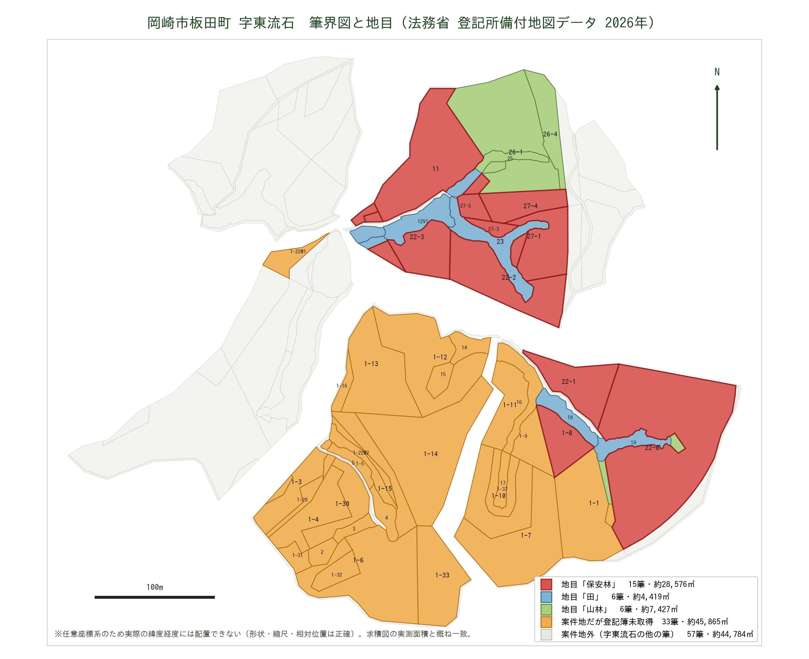
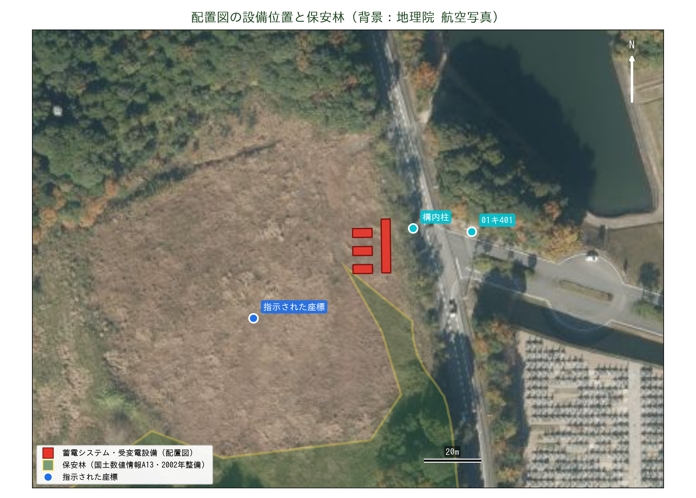
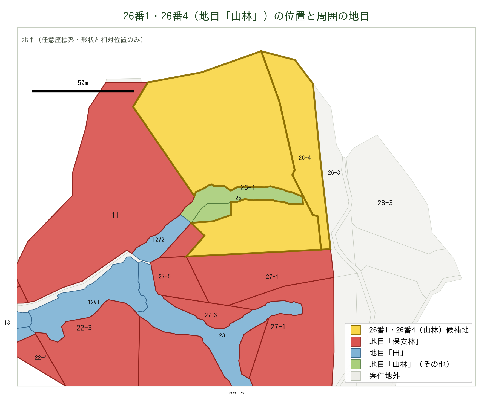

# 保安林 該当確認レポート

| 項目 | 内容 |
| --- | --- |
| 対象座標 | 34.962114039819326, 137.23105862800367 |
| 所在 | 愛知県岡崎市板田町 字東流石（市区町村コード 23202） |
| 判定日 | 2026-09-08 |
| 使用資料 | 全部事項証明書 27筆（名古屋法務局豊田支局 令和7年10月2日発行）／求積図 S=1:2000／公図（26番4、出力縮尺1/600、2026-09-08表示）／法務省 登記所備付地図データ（2026年2月）／国土数値情報「森林地域(A13-15 愛知県)」 |
| 説明資料 | [保安林確認_岡崎市板田町.pptx](./保安林確認_岡崎市板田町.pptx) |

## 結論

**案件地には保安林が含まれる。** 提供された27筆のうち **15筆が登記地目「保安林」**（登記地積の合計 18,203.43㎡＝約1.82ha）。

座標1点に対する公開データ（国土数値情報 A13）だけの判定では「保安林 非該当（最寄り境界まで約37m）」だったが、登記簿により実態が判明した。**公開GISによる机上判定は本件では実態を過小評価している。**

## 判定結果

### 登記簿による判定（確度：高）

| 地目 | 筆数 | 登記地積合計 |
| --- | ---: | ---: |
| **保安林** | **15筆** | **18,203.43㎡（約1.82ha）** |
| 田 | 6筆 | 4,262㎡ |
| 山林 | 6筆 | 7,216㎡ |
| 合計 | 27筆 | 29,681.43㎡ |

**地目「保安林」の15筆**

| 地番 | 地積(㎡) | 地番 | 地積(㎡) | 地番 | 地積(㎡) |
| --- | ---: | --- | ---: | --- | ---: |
| 1番8 | 991 | 22番2 | 1,562 | 27番1 | 540 |
| 11番 | 2,264 | 22番3 | 1,368 | 27番2 | 198 |
| 11番1 | 9.91 | 22番4 | 9.91 | 27番3 | 264 |
| 11番2 | 6.61 | 22番8 | 5,146 | 27番4 | 94 |
| 22番1 | 4,958 | 26番2 | 297 | 27番5 | 495 |

※22番8・22番2・27番1・27番4は分筆後の地積。26番1は昭和46年に一部地目変更あり。

**地目「田」「山林」の12筆**

| 地番 | 地目 | 地積(㎡) | 地番 | 地目 | 地積(㎡) |
| --- | --- | ---: | --- | --- | ---: |
| 12番 | 田 | 1,233 | 19番1 | 山林 | 304 |
| 13番 | 田 | 261 | 21番 | 山林 | 26 |
| 18番 | 田 | 730 | 24番 | 山林 | 33 |
| 19番 | 田 | 611 | 25番 | 山林 | 383 |
| 22番5 | 田 | 95 | 26番1 | 山林 | 5,346 |
| 23番 | 田 | 1,332 | 26番4 | 山林 | 1,124 |

## 筆界図（法務省 登記所備付地図データ 2026年）

字東流石の全119筆を描画し、登記簿で確認できた地目で色分けしたもの。



| 区分 | 筆数 | 公図面積 |
| --- | ---: | ---: |
| 地目「保安林」 | 15筆 | 約 28,576㎡（約2.86ha） |
| 地目「田」 | 6筆 | 約 4,419㎡ |
| 地目「山林」 | 6筆 | 約 7,427㎡ |
| **案件地だが登記簿未取得（地目不明）** | **33筆** | **約 45,865㎡（約4.59ha）** |
| 案件地 計 | 60筆 | 約 86,289㎡ |
| （参考）字東流石のうち案件地外 | 57筆 | 約 44,784㎡ |

**図から分かること**

1. **保安林は北ブロックと東縁に集中** — 11番・22番台・26番2・27番台がまとまって北側を占め、22番1・22番8・1番8が東縁を構成する。案件地の骨格部分に重なっている。
2. **保安林の実面積は約2.86ha** — 公図面積 28,576㎡。登記地積の合計1.82haより約1ha大きい。山林の縄伸びによるもので、実際に規制がかかる範囲はこちらに近い。
3. **地目未確認が33筆・約4.59ha** — 南側の大きな1番台ブロックが丸ごと未確認。確定済みの保安林より広く、ここに保安林が含まれると案件成立性が大きく変わる。
4. **公図の精度は実用水準** — 主要筆の公図面積は求積図の実測値と概ね一致（22番8：公図10,620㎡／実測11,558.85㎡、11番：公図4,677㎡／実測4,989.30㎡）。レイアウト検討の下図として使える。

**制約** — この地図データの座標系は **任意座標系** であり、実際の緯度経度には配置できない（形状・縮尺・相対位置は正確）。実座標に載せるには、現地測量または既知点との対応付け（幾何補正）が必要。

### 公開データによる座標判定（参考・確度：低）

| レイヤ | 判定 | 補足 |
| --- | --- | --- |
| 保安林 | 非該当 | 最寄り境界まで約36.6m（東北東）。最寄点 34.962276, 137.231409 |
| 国有林 | 非該当 | 最寄り約15.2km |
| 地域森林計画対象民有林 | **該当** | 内包 |
| 森林地域（土地利用基本計画） | **該当** | 内包 |


## かかる規制と手続

| # | 規制 | 根拠 | 内容 |
| --- | --- | --- | --- |
| 1 | **保安林** | 森林法 25条・34条 | 指定区域内の立木伐採・土地の形質変更は県知事の許可が必要。蓄電所用地としては原則不適。解除は代替施設がない等の要件が必要で実務上きわめて困難。 |
| 2 | **林地開発許可** | 森林法 10条の2 | 地域森林計画対象民有林で1ha超の開発に必要。配置図の設備（約400㎡）単独なら対象外。ただし既に約1.8haが伐開済みで、過去の許可の有無により扱いが変わる（後述「26番1への配置案」参照）。 |
| 3 | **伐採及び伐採後の造林の届出** | 森林法 10条の8 | 1ha以下の伐採でも岡崎市への事前届出が必要（伐採90〜30日前）。 |

※太陽光は0.5ha超で林地開発許可の対象。蓄電所は「その他」区分で1ha超が基準。

## リスクと検討論点

| リスク度 | 論点 | 内容 |
| --- | --- | --- |
| 高 | 保安林区域が造成範囲に入る | 15筆・登記地積で約1.82ha。造成レイアウト次第では案件不成立。 |
| 高 | 未取得登記簿に追加の保安林がある可能性 | 案件地60筆のうち**33筆・約4.59ha**が地目未確認。確定済みの保安林（2.86ha）より広い。全筆の地目確認が必須。 |
| 中 | 既存の伐開約1.8haの適法性 | 航空写真では既に更地化。1ha超の伐開なら林地開発許可が必要だったはず。無許可なら復旧命令リスクを買主が引き継ぐ。 |
| 中 | 登記地積と実測面積の乖離 | 27筆の登記地積 29,681㎡ に対し求積図の実測合計は 99,100㎡。用地費・面積前提の再確認が必要。 |
| 中 | 里道・水路（法定外公共物）が敷地内を通る | 公図に「道」の注記。求積図の道①〜④＝1,481.37㎡が案件地内。用途廃止・払下げを岡崎市と協議する必要がある。 |
| 低 | 公開GISでの事前確認が効かない | 愛知県は保安林レイヤを公開していない。県への直接照会が唯一の確定手段。公図の座標系欄も空欄で、実座標に載せられない。 |

## 次のアクション

1. **【最優先】保安林指定図・保安林台帳の閲覧** — 愛知県 西三河農林水産事務所 林務課（0564-27-2733）に27筆の地番を提示し、保安林の指定範囲・種類（水源かん養／土砂流出防備等）と指定年月日を確認する。
2. **【最優先】未取得33筆の登記事項証明書を取得** — 公図で特定した1番台ほか33筆（約4.59ha）の地目を確認し、保安林の全体像を確定させる。
3. **保安林と里道を除いた造成レイアウトの検討** — 保安林を避けて必要面積が確保できるかを設計側と確認。敷地内の里道・水路（求積図の道①〜④＝1,481.37㎡）は岡崎市と用途廃止・払下げを協議する。確保できない場合は案件の継続可否を判断。
4. **林地開発許可の事前相談** — 同事務所へ約4.3haの開発計画で事前相談。調整池・緑地の要求水準とスケジュールを把握する。

照会時は地番一覧（27筆＋未取得分）と求積図を持参すると回答が早い。

## データの限界

- 国土数値情報 A13 は土地利用基本計画における「参考表示」の位置づけで、国土交通省自身が「細区分（国有林・地域森林計画対象民有林・保安林）のデータは精度を保証できない」と明記している。保安林ポリゴンの整備年度は **2002年度**。
- 本件はまさにその限界が顕在化した事例で、A13上「非該当」の座標が、登記簿では保安林を含む案件地の中にある。
- 愛知県の公開GIS「マップあいち／森林情報マップ」には保安林レイヤが無い（森林計画区域・林班界・林相図のみ）。
- 登記地目「保安林」は保安林指定の強い証拠だが、**指定範囲そのものは筆界と一致しない**ことがある。最終確定は県の保安林指定図による。

## 配置図の設備位置（2026-09-09 追記）

配置図「愛知県岡崎市 配置図」（株式会社パワーエックス／株式会社イノスタ、2026.02.03、縮尺1/320）の背景航空写真を地理院航空写真に重ね合わせ、設備の実位置を推定した。



### 位置合わせの方法

- 図面上の赤いGoogleピン ＝ 指示された座標（34.962114, 137.231059）を基準点とした
- 図面の寸法注記（6,700／18,500／3,200）から縮尺 0.047 m/px を決定（PDF上の実寸は約1/278）
- 市道の走向（地理院写真では方位171°、図面上では159°）から図面の回転 −11.6° を決定
- 重ね合わせ画像（[配置図_航空写真重ね合わせ.png](./img/配置図_航空写真重ね合わせ.png)）で道路・林縁・作業道が一致することを確認
- **推定誤差は±10m程度。法的な位置ではない。**

### 推定座標

| 設備 | 緯度 | 経度 | A13保安林境界まで |
| --- | --- | --- | ---: |
| 設備全体の重心 | 34.962328 | 137.231498 | 9.6 m |
| 受変電設備・昇圧変圧器・PCS・ESS監視盤（18.5m列） | 34.962337 | 137.231564 | 14.2 m |
| 蓄電システム（北） | 34.962382 | 137.231475 | 13.2 m |
| 蓄電システム（中） | 34.962325 | 137.231476 | 8.1 m |
| 蓄電システム（南） | 34.962268 | 137.231476 | **3.2 m** |
| 構内柱 | 34.962396 | 137.231668 | 25.2 m |
| 01キ401（既設電柱） | 34.962386 | 137.231893 | 37.3 m |

### 分かったこと

1. **設備は更地の東端・市道沿い** — 指示座標から北東へ約47m。蓄電システム3基（6.7m×3.1m）＋受変電列（18.5m×6.2m）で約20m×20m。
2. **保安林境界まで3〜14m** — 南の蓄電システムでA13境界から約3m。位置合わせ誤差（±10m）とA13の精度（2002年整備・精度保証なし）を考えると、**保安林にかかっている可能性がある**。県の保安林指定図での確認が必須。
3. **西側に寄せれば回避余地あり** — 保安林は東〜南東側。更地の中央〜西側は保安林から離れており、20m程度西へずらすだけで安全側になる。
4. **規模が求積図と整合しない** — 配置図は約400㎡・高圧連系（電柱番号 01キ401 から約20m引込）。求積図の検討面積4.3haとは桁が違う。同一案件の段階計画か、別案件かの確認が必要。

Google Earth 用の [保安林_周辺_A13.kml](./保安林_周辺_A13.kml) に設備ポリゴンと構内柱・01キ401を追加した（フォルダ「配置図の設備」）。

## 26番1（地目「山林」）への配置案の評価（2026-09-09 追記）

### 接続検討資料から分かったこと

| 項目 | 内容 |
| --- | --- |
| 発電者名 | PX愛知県岡崎市蓄電所（株式会社パワーエックス） |
| 発電場所 | 愛知県岡崎市板田町字東流石 27番1 他26筆（＝本レポートの27筆と一致） |
| 規模 | 最大受電電力 1,994kW／PCS PVI1400CJ-3/2600（1,999kW上限設定）／蓄電池 Mega Power 2700A 2,468kWh×3台＝7,404kWh |
| 連系 | 高圧・大平変電所F36 01キ401から分岐（ノンファーム型接続適用） |
| 接続検討回答（2026-06-03） | 連系可。工事費負担金 7,224千円（税抜）。バンク逆潮流対策工事（2028年度下期予定）後に連系可 |
| 地権者 | 有限会社三敬（14筆）・中部産業株式会社（13筆）。いずれも「地権者了承済み」 |
| 申込書の地目欄 | **15筆を「保安林」と記載済み**。山林は 26番1・26番4・24・19番1・21 の5筆 |

接続検討申込書（様式6）にも地目「保安林」が明記されており、事業者側は保安林の存在を認識したうえで申し込んでいる。また、求積図の検討面積4.3haは土地側の提示面積であり、事業の実規模は配置図の約400㎡（設備）である。**本レポート前段の「林地開発許可が確実に必要」は4.3haを前提にした記述であり、実規模ベースでは下記③のとおり修正する。**

### 26番1への配置は可能か

結論：**27筆の中では最も有望。ただし「地目が山林だから保安林ではない」とは言い切れず、3点の確認が前提。**



| # | 確認事項 | 内容 |
| --- | --- | --- |
| ① | **保安林台帳で26番1が指定外であること** | 保安林の指定（森林法25条）と登記地目は別の制度。指定後の地目変更登記は漏れることがあり、地目「山林」でも指定区域内の土地は存在する。26番1は西（11番）・南（26番2・27番4・27番5）を保安林に囲まれた島状の筆。昭和46年の一部地目変更・分筆（26番2・26番3）が保安林指定に伴うものなら、26番1本体は指定外である可能性が高いが、**保安林台帳・指定図で確認するまでは断定できない**。 |
| ② | **引込・進入路が保安林を通らないこと** | 26番1は市道に面していない。01キ401からの高圧引込と車両進入は 26番4 → 26番3・29番2（案件地外）を経由する見込み。**保安林内での電柱建柱・道路造成は森林法34条2項の作業許可対象**なので、ルートが11番・27番台にかかると別途許可が要る。案件地外の26番3・29番2を通る場合はその地権者の同意が必要。 |
| ③ | **伐採届で足りる規模であること** | 26番1（公図5,298㎡）＋26番4（1,284㎡）＝約0.66ha。配置図の設備約400㎡＋構内造成なら1haに達せず、**林地開発許可（森林法10条の2）は不要、岡崎市への伐採届（10条の8）のみ**。ただし現地は航空写真上すでに約1.8haが伐開・更地化されている。1ha超の伐開なら林地開発許可が必要だったはずで、**無許可であれば復旧命令のリスクを買主が引き継ぐ**。過去の許可・届出の有無を売主に確認すること。 |

### 実務上の進め方

1. 西三河農林水産事務所で **26番1・26番4・26番3・29番2** の保安林指定の有無を確認（①・②を同時に潰す）
2. 中部電力PGに引込ルート変更（構内柱位置）を相談。接続検討の前提変更に当たる場合は再検討が必要になる可能性
3. 売主に既存伐開の経緯（時期・面積・許可の有無）を書面で確認
4. 岡崎市 林務担当に伐採届の要否・様式を確認

## 公図（地図に準ずる図面）で確認できたこと

26番4を請求部分とする公図（出力縮尺 1/600）から、以下を確認した。

### 図面の種別 — Googleマップに載せられない理由の裏付け

| 欄 | 記載 |
| --- | --- |
| 分類 | 地図に準ずる図面 |
| 種類 | 旧土地台帳附属地図 |
| 精度区分 | **空欄** |
| **座標系番号又は記号** | **空欄** |
| 作成年月日・備付年月日 | 空欄 |

座標系欄が空欄＝**公共座標を持たない**。この字には不動産登記法14条地図が備え付けられておらず、旧土地台帳附属地図（いわゆる公図）しかない。前節「Googleマップでの確認」で筆界を実座標に載せられないと判断した理由が、公的な記載として裏付けられた。精度区分も空欄のため、**面積・境界の精度は保証されない**。

### 筆界図の配置が正しいことを検証できた

公図の並び（26番1の東に26番4、その南に25→24→26番2、南西に12・27番5、南東に27番4→27番1・23、西に11）は、本レポートの筆界図と完全に一致した。法務省地図データから起こした筆界図の向き・配置は正しい。

### 新たに判明：里道・水路（法定外公共物）が敷地内を通る

公図に「道」の注記が3か所（北西隅・南西隅・中央右下）。法務省地図データでも字東流石には **道11筆（約2,987㎡）・水路1筆（約394㎡）・長狭物不明1筆（約404㎡）** が存在する。求積図の「道①〜④ 合計 1,481.37㎡」が案件地内に相当する。

**里道・水路は国または市の財産であり、そのままでは造成できない。** 岡崎市と用途廃止・払下げ（または付替え）の協議が必要で、手続に数か月かかる。用地取得スケジュールに織り込むこと。

### 新たに判明：北側は別の地番区域（字）

公図の北端に並ぶ 1番2・1番8・1番1・1番9・4番2 は、字東流石ではなく隣接する字（地番区域見出は「字行事」を表示）の地番。字東流石の北端は9番台・10番台である。

**同じ「1番8」でも字が違えば別の土地。** 登記簿・公図を追加請求する際は、必ず字（小字）まで指定すること。

### 公図では分からないこと

- 地目・所有者 → 登記事項証明書
- 保安林の指定範囲 → 愛知県 西三河農林水産事務所（保安林指定図）
- 正確な境界・面積 → 現地測量（境界確定）

## Googleマップ／Google Earth での確認

### できること：[保安林_周辺_A13.kml](./保安林_周辺_A13.kml)

対象地点のピンと、国土数値情報A13の保安林・地域森林計画対象民有林（半径1.5km）を収めたKML。**正しい緯度経度を持つ**ので、そのまま重ねて確認できる。

- Google Earth（ウェブ版 https://earth.google.com/web/ ）→ 左メニュー「プロジェクト」→「開く」→「パソコンからKMLファイルをインポート」
- Google マイマップ（https://www.google.com/mymaps ）→「新しい地図を作成」→「インポート」

対象地点を直接開くリンク：
- [Googleマップ](https://www.google.com/maps/search/?api=1&query=34.962114,137.231059)
- [Googleマップ 航空写真](https://www.google.com/maps/@34.962114,137.231059,17z/data=!3m1!1e3)
- [Google Earth](https://earth.google.com/web/@34.962114,137.231059,200a,1500d,35y,0h,0t,0r)
- [地理院地図](https://maps.gsi.go.jp/#16/34.962114/137.231059/)

### できないこと：筆界（公図）の重ね合わせ

法務省の登記所備付地図データは **任意座標系** で、実座標との対応情報を持たない。地形（谷筋と「田」の筆の位置）およびA13保安林との自動照合を試みたが、**解が一意に定まらなかった**（回転角7°と157°という全く異なる候補が同程度のスコアで得られた）。対象地は全域が林地で、航空写真からも筆界が判読できない。

**したがって、現時点で筆界をGoogleマップ上の正しい位置に載せることはできない。** 無理に重ねると数十m〜百m単位でずれ、用地判断を誤らせる。

### 筆界を実座標に載せる方法（推奨順）

1. **求積図を作成した測量会社に座標データを請求する（最短・最確実）** — S=1:2000の求積図と求積表がある以上、平面直角座標系第7系の座標データ（CAD/SIMA形式）を保有している可能性が高い。これが得られれば即座に実座標へ変換できる。
2. **現地でGPS実測** — 境界杭・主要な筆界点の座標を取得して幾何補正する。
3. **岡崎市の地番参考図／商用の全国地番図を購入** — 概略位置の把握には使えるが、法的な境界にはならない。

いずれの方法でも、**得られる筆界は「参考位置」であり法的な境界確定ではない**。境界確定には隣接地所有者との立会いが必要。

## 参考リンク

- [愛知県「保安林と林地開発」](https://www.pref.aichi.jp/soshiki/shinrin/0000002622.html)
- [愛知県「森林簿・森林計画図の閲覧・交付について」](https://www.pref.aichi.jp/soshiki/rinmu/etsurankouhu.html)
- [マップあいち（愛知県統合型GIS）](https://maps.pref.aichi.jp/)
- [岡崎市「森林の伐採には届け出が必要です」](https://www.city.okazaki.lg.jp/1300/1303/1324/p010554.html)
- [国土数値情報 森林地域（A13）](https://nlftp.mlit.go.jp/ksj/gml/datalist/KsjTmplt-A13.html)
- [法務省 登記所備付地図データ（G空間情報センター）](https://www.geospatial.jp/ckan/dataset/houmusyouchizu-2026-1-1109)
- [地理院地図で対象地を表示](https://maps.gsi.go.jp/#16/34.962114/137.231059/)

## 再判定の方法（他座標での事前スクリーニング用）

```
pip install pyshp
python3 scripts/check_hoanrin.py --lat 34.962114 --lon 137.231059
```

筆界図の再作成：

```
pip install matplotlib
python3 scripts/parse_moj_chizu.py <地図XML> 字東流石 out.json
python3 scripts/render_fude_map.py
```

ただし上記のとおり公開データ単独では見落としが出る。**登記簿の地目確認と県への照会が必須。**
